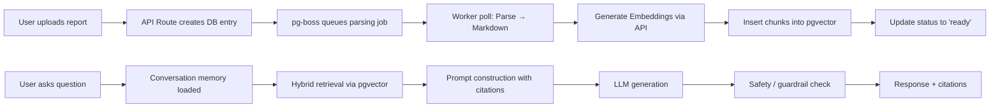

# Simplified Production-Grade Architecture for MedBot

## 1. Architecture Overview

The simplified architecture for the Medical Understanding Platform (MedBot) is designed specifically for a solo developer operating within strict resource constraints: **2 vCPU, 8GB RAM, and no Kubernetes**. This architecture prioritizes operational simplicity, leveraging managed services to offload infrastructure overhead while maintaining production readiness and strict medical safety boundaries.

The core philosophy of this simplified stack is **consolidation**. Instead of deploying multiple microservices (e.g., separate ingestion workers, vector databases, and inference tiers), the system is built as a unified Next.js application that interacts with managed backend services.

### 1.1 Component Diagram

```mermaid
graph TB
    subgraph Client["Client Layer"]
        WEB[Next.js / React / Tailwind Web App]
    end

    subgraph Auth["Authentication"]
        CLERK[Clerk — session, JWT, org/user mgmt]
    end

    subgraph API["API Layer — Next.js Route Handlers"]
        GATEWAY[API Gateway / BFF]
        RATE[Rate Limiter]
    end

    subgraph RAGCore["RAG Orchestration Core"]
        LANGGRAPH[LangGraph State Machine]
        RETRIEVE[pgvector Retrieval]
        PROMPT[Prompt Constructor]
    end

    subgraph Data["Data & Storage"]
        SUPA[(Supabase Postgres + pgvector)]
        STOR[(Supabase Storage)]
    end

    subgraph External["External Services"]
        LLM[OpenAI API / LiteLLM]
        MEDAPI[Medical APIs (RxNorm/LOINC)]
        LANGFUSE[Langfuse Cloud]
    end

    subgraph Observability["Observability"]
        SENTRY[Sentry]
    end

    WEB --> CLERK --> GATEWAY
    GATEWAY --> RATE --> LANGGRAPH
    WEB -- upload report --> GATEWAY --> LANGGRAPH
    LANGGRAPH --> RETRIEVE --> SUPA
    GATEWAY -- async job --> SUPA
    SUPA -- background worker --> GATEWAY
    LANGGRAPH --> PROMPT --> LLM
    LLM --> LANGFUSE
    GATEWAY --> SENTRY
    LANGGRAPH --> MEDAPI
    LANGGRAPH --> GATEWAY --> WEB
```

### 1.2 Data Flow Diagram

The data flow in the simplified architecture relies heavily on database-backed job queues to handle asynchronous tasks like document parsing and embedding generation, eliminating the need for a separate worker service.



## 2. Technology Stack Decisions

The technology stack has been aggressively streamlined to fit the 8GB RAM constraint and reduce operational complexity.

| Layer | Original Choice | Simplified Choice | Rationale |
|---|---|---|---|
| **Database & Vector DB** | Supabase Postgres + Qdrant | **Supabase Postgres with `pgvector`** | Consolidates metadata and vector storage into a single managed database, drastically reducing RAM usage and ops overhead. |
| **Object Storage** | Storj + Supabase Storage | **Supabase Storage** | Reduces the number of external providers. Supabase Storage is sufficient for storing raw PDF reports. |
| **Queue/Workers** | Redis + BullMQ + Worker Service | **`pg-boss` (PostgreSQL-backed queue)** | Eliminates the need for a separate Redis container and worker service. Jobs are processed by polling the existing database. |
| **Orchestration** | LangGraph + LlamaIndex | **LangGraph** | LangGraph provides the necessary explicit state machine for enforcing medical safety gates without the additional abstraction overhead of LlamaIndex. |
| **LLM Gateway** | LiteLLM + Self-hosted vLLM | **OpenAI API (or LiteLLM proxying to API)** | Self-hosted inference (vLLM) requires significant GPU/RAM resources incompatible with the 8GB constraint. API-based LLMs are the only viable option. |
| **Document Parsing** | Docling + VLM OCR | **Lightweight PDF parser (e.g., `pdf-parse`)** | Simplifies ingestion. Advanced OCR is deferred to a later phase to save compute resources. |
| **Re-ranking** | BGE-reranker-v2-m3 | **None (Simple `LIMIT` search)** | Dropping re-ranking reduces latency and compute requirements. A simple top-K vector search is sufficient for the MVP. |
| **Observability** | Langfuse + Prometheus + Grafana + Sentry | **Sentry + Langfuse Cloud** | Eliminates self-hosted Prometheus and Grafana. Uses managed cloud services to save RAM. |

## 3. RAG Pipeline Design

The RAG pipeline is implemented within the Next.js API layer, orchestrated by LangGraph to ensure strict adherence to medical safety protocols.

### 3.1 Ingestion Pipeline (Asynchronous)
When a user uploads a report:
1. The file is stored in Supabase Storage.
2. A metadata record is created in Supabase Postgres with a status of `processing`.
3. A job is inserted into `pg-boss`.
4. A lightweight parser extracts text from the PDF.
5. The text is split into chunks (e.g., 500 tokens with 50 token overlap).
6. Embeddings are generated via an API call (e.g., OpenAI `text-embedding-3-small`).
7. The chunks and embeddings are inserted into a table utilizing the `pgvector` extension.
8. The report status is updated to `ready`.

### 3.2 Query Pipeline (Synchronous)
When a user asks a question:
1. **Intent Classification (LangGraph Node):** The user's query is analyzed to determine if it is a standard report question, an exercise request, or a prohibited topic (e.g., diagnosis).
2. **Safety Gate (LangGraph Node):** If the query is prohibited, the graph routes to a hard-coded refusal response.
3. **Retrieval (LangGraph Node):** If the query is safe, a vector search is performed against the user's report chunks using `pgvector`.
4. **Medical API Enrichment (Optional LangGraph Node):** If the query involves specific medical terms, an external API (e.g., RxNorm) may be queried for context.
5. **Prompt Construction (LangGraph Node):** The system prompt, retrieved chunks, and medical context are assembled.
6. **Generation (LangGraph Node):** The assembled prompt is sent to the LLM API.
7. **Post-Generation Safety Check (LangGraph Node):** The response is evaluated to ensure it contains the required citations and does not violate safety boundaries. If it fails, the prompt is regenerated with stricter instructions.
8. **Response Delivery:** The final response is streamed back to the user.

## 4. Hallucination Mitigation Strategy

Preventing hallucinations is critical for a medical understanding platform. The simplified architecture employs several structural defenses.

1. **Grounded RAG:** The system prompt explicitly instructs the LLM to only state facts present in the retrieved report chunks or cited medical sources. If the information is not present, the LLM must state so explicitly rather than inferring.
2. **Strict Citation Enforcement:** The LLM is required to output inline citations (e.g., `[chunk_id]`). A post-processing step in the API route parses these citations and verifies them against the retrieved context. If a factual claim lacks a citation, the response is rejected.
3. **Prompt Injection Defense:** All extracted text from uploaded reports is treated strictly as data. It is wrapped in clearly delimited XML tags (e.g., `<retrieved_context>`) within the prompt, with an explicit instruction that this content is data to be analyzed, not instructions to be followed.
4. **Refusal Policy:** The system prompt contains an explicit, enumerated refusal policy. Questions seeking a diagnosis, specific drug dosage, or treatment recommendations are automatically reframed or refused by the LangGraph state machine.

## 5. Stress Test Analysis

The simplified architecture is designed to run on a server with 2 vCPU and 8GB RAM. The following analysis identifies potential bottlenecks at various user scales.

| User Scale | Primary Bottlenecks | Mitigation Strategy |
|---|---|---|
| **100 Users** | **RAM:** Running Next.js, maintaining Postgres connections, and the Langfuse SDK can consume memory. | Optimize Next.js memory usage. Ensure `pg-boss` does not poll the database too frequently. |
| **500 Users** | **CPU:** Concurrent document parsing will spike CPU usage. | Implement strict rate limiting on uploads. Queue heavy parsing tasks efficiently using `pg-boss`. |
| **1000 Users** | **Database:** Connection pool exhaustion on Supabase Postgres. | Rely on Supabase's built-in connection pooler (Supavisor). Implement caching for frequent queries. |
| **5000 Users** | **Network & API Limits:** Hitting rate limits on OpenAI/LLM APIs during concurrent chat requests. | Implement aggressive caching (Redis or in-memory cache like `lru-cache`) for identical queries. Use streaming responses to reduce perceived latency. |

## 6. Failure Mode and Effects Analysis (FMEA)

The following table outlines potential failure modes in the simplified architecture and their respective mitigations.

| Failure Mode | Effect | Probability | Severity | Mitigation Strategy |
|---|---|---|---|---|
| **LLM API Timeout** | User experiences long wait times or request failure. | Medium | Medium | Implement retry logic with exponential backoff. Provide immediate feedback to the user while waiting. |
| **Database Connection Pool Exhaustion** | API routes fail to connect to Supabase, resulting in 500 errors. | Medium | High | Use Supabase connection pooler. Limit concurrent active queries in the Next.js API routes. |
| **Prompt Injection via PDF** | LLM generates unsafe or hallucinated content based on malicious text in a report. | Low | Critical | Treat all PDF text as data using strict delimiters. Implement a post-generation safety check that verifies citations. |
| **Worker Crash (Job Failure)** | Document parsing or embedding generation fails, leaving the report in a "processing" state. | Medium | Low | Implement retry mechanisms within `pg-boss`. Provide a UI option for users to manually retry failed uploads. |
| **Memory Leak in Node.js** | Next.js process crashes due to unmanaged memory growth over time. | Low | High | Use standard profiling tools. Ensure streams (like LLM responses) are properly closed and garbage collected. |

## 7. Security Audit

The simplified architecture must maintain high security standards, especially when handling medical documents.

1. **Encryption and Access Control:** All data in transit must be encrypted via TLS. Supabase handles encryption at rest for the Postgres database. Row-Level Security (RLS) policies must be enforced on all database tables to ensure users can only access their own data.
2. **Authentication and Authorization:** Clerk handles authentication. Authorization is enforced via Supabase RLS. The Next.js API routes must verify the user's session token before making any database queries or LLM calls.
3. **Data Retention and Privacy:** Implement a clear data retention policy. Users must be able to delete their accounts and all associated data (reports, chat history) easily. Ensure that any text sent to the LLM API is not stored permanently by the provider (adhering to their enterprise privacy terms).

## 8. CI/CD Pipeline and Deployment Guide

### CI/CD Pipeline
The CI/CD pipeline should be straightforward, utilizing GitHub Actions.

1. **Lint and Test:** Run ESLint and unit tests (Jest/Vitest) on push.
2. **Build:** Ensure the Next.js application builds successfully.
3. **Deploy:** If deploying to a managed platform (e.g., Vercel, Render, or DigitalOcean App Platform), use the platform's native GitHub integration for automatic deployments. If deploying via Docker Compose on a VPS, the pipeline can SSH into the server, pull the latest image, and restart the containers.

### Deployment Guide (Docker Compose)
For deployment on a single VPS (2 vCPU, 8GB RAM), the following `docker-compose.yml` structure is recommended:

```yaml
version: '3.8'
services:
  app:
    build: .
    ports:
      - "3000:3000"
    environment:
      - DATABASE_URL=${DATABASE_URL}
      - OPENAI_API_KEY=${OPENAI_API_KEY}
      - CLERK_SECRET_KEY=${CLERK_SECRET_KEY}
      - LANGFUSE_PUBLIC_KEY=${LANGFUSE_PUBLIC_KEY}
      - LANGFUSE_SECRET_KEY=${LANGFUSE_SECRET_KEY}
    restart: always
```

This single-container approach (assuming Supabase is managed externally) minimizes RAM usage and operational complexity, perfectly aligning with the solo developer constraint.
